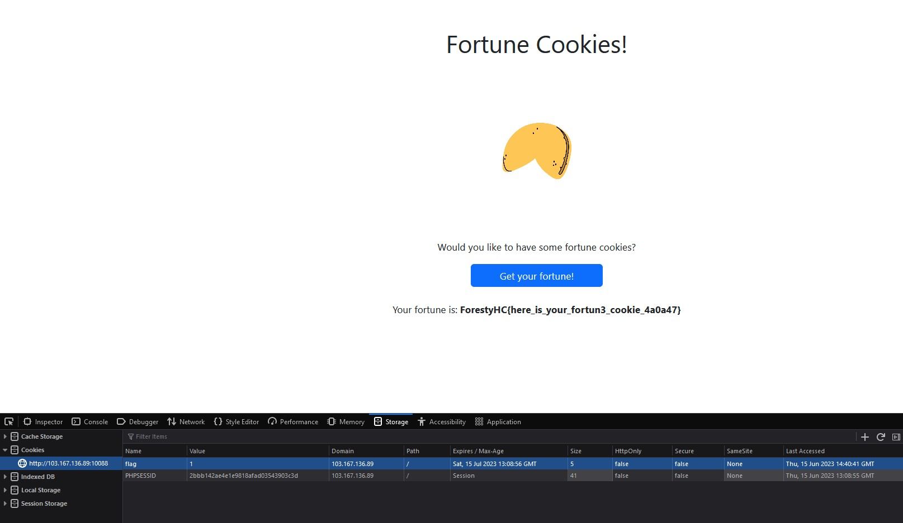

# fortuneCookie
> Would you like to have some fortune cookies? http://103.167.136.89:10088/ Author: bleedz#0666 (Discord) / @bl33dz (Tele)

## About the Challenge
Diberikan sebuah gambar page challenge dan inspect element pada page dengan value pada cookie adalah 1 (what you got from the chall)



## Solution
Melakukan inspect element pada browser dan ke bagian storage dan menemukan bagian "Cookie" pada terdapat nama "flag" dengan value "0". Mengubah value dari 0 menjadi 1 dan saat melakukannya flag yang disembunyikan muncul.

```shell
To put your image on github using

```

```shell
if __name__ == "__main__":
  print("Put your code or payload in here")
```

```
ForestyHC{here_is_your_fortun3_cookie_4a0a47}
```