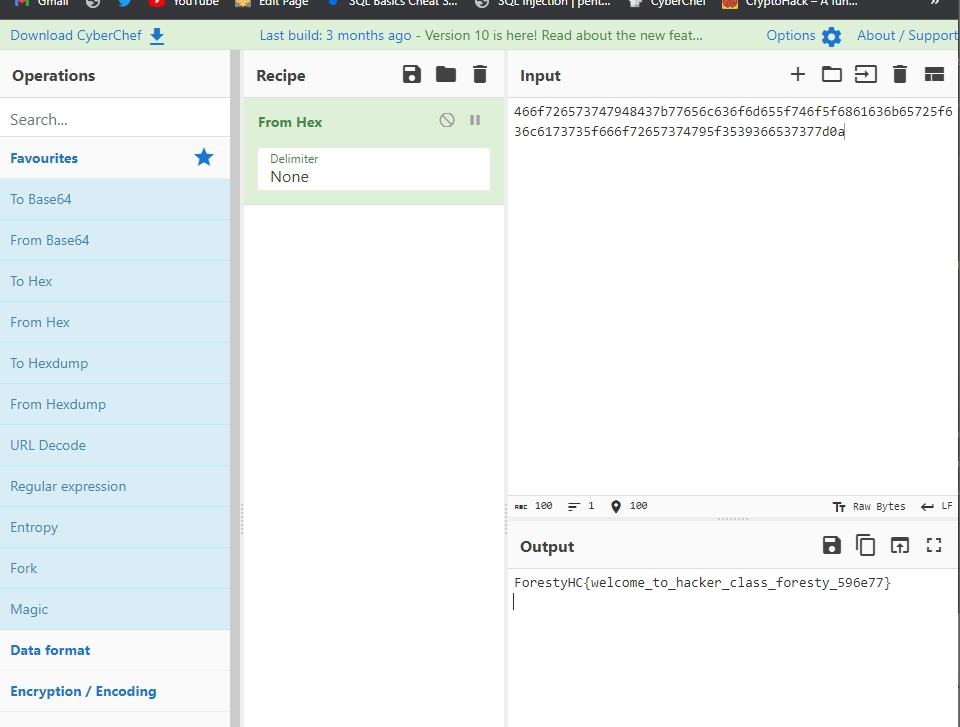

# fortuneCookie
> Here is your flag: 466f726573747948437b77656c636f6d655f746f5f6861636b65725f636c6173735f666f72657374795f3539366537377d0a

## About the Challenge
Diberikan sebuah gambar page cyber chef untuk men decrypt flag yang diberikan (what you got from the chall)



## Solution
Melakukan decrypt dengan bantuan web cyberchef, diketahui bahwa flag yang diberikan merupakan hexadecimal dan dapat dikonversikan ke tulisan 

```shell
To put your image on github using

```

```shell
if __name__ == "__main__":
  print("Put your code or payload in here")
```

```
ForestyHC{welcome_to_hacker_class_foresty_596e77}
```